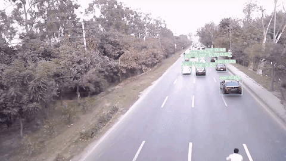

## Pretrained Checkpoints

| Model | AP<sup>val</sup> | AP<sup>test</sup> | AP<sub>50</sub> | Speed<sub>GPU</sub> | FPS<sub>GPU</sub> || params | FLOPS |
|---------- |------ |------ |------ | -------- | ------| ------ |------  |  :------: |
| [YOLOv3](https://github.com/ultralytics/yolov3/releases)      | 43.3   | 43.3     | 63.0     | 4.8ms     | 208     || 61.9M  | 156.4B
| [YOLOv3-SPP](https://github.com/ultralytics/yolov3/releases)  | **44.3**   | **44.3**     | **64.6**     | 4.9ms     | 204     || 63.0M  | 157.0B
| [YOLOv3-tiny](https://github.com/ultralytics/yolov3/releases) | 17.6     | 34.9     | 34.9     | **1.7ms**     | **588**     || 8.9M  | 13.3B

** AP<sup>test</sup> denotes COCO [test-dev2017](http://cocodataset.org/#upload) server results, all other AP results denote val2017 accuracy.  
** All AP numbers are for single-model single-scale without ensemble or TTA. **Reproduce mAP** by `python test.py --data coco.yaml --img 640 --conf 0.001 --iou 0.65`  
** Speed<sub>GPU</sub> averaged over 5000 COCO val2017 images using a GCP [n1-standard-16](https://cloud.google.com/compute/docs/machine-types#n1_standard_machine_types) V100 instance, and includes image preprocessing, FP16 inference, postprocessing and NMS. NMS is 1-2ms/img.  **Reproduce speed** by `python test.py --data coco.yaml --img 640 --conf 0.25 --iou 0.45`  
** All checkpoints are trained to 300 epochs with default settings and hyperparameters (no autoaugmentation). 
** Test Time Augmentation ([TTA](https://github.com/ultralytics/yolov5/issues/303)) runs at 3 image sizes. **Reproduce TTA** by `python test.py --data coco.yaml --img 832 --iou 0.65 --augment` 

## Requirements

Python 3.8 or later with all [requirements.txt](https://github.com/ultralytics/yolov3/blob/master/requirements.txt) dependencies installed, including `torch>=1.7`. To install run:
```bash
$ pip install -r requirements.txt
```


## Tutorials

* [Train Custom Data](https://github.com/ultralytics/yolov3/wiki/Train-Custom-Data)&nbsp; 🚀 RECOMMENDED
* [Weights & Biases Logging](https://github.com/ultralytics/yolov5/issues/1289)&nbsp; 🌟 NEW
* [Multi-GPU Training](https://github.com/ultralytics/yolov5/issues/475)
* [PyTorch Hub](https://github.com/ultralytics/yolov5/issues/36)&nbsp; ⭐ NEW
* [ONNX and TorchScript Export](https://github.com/ultralytics/yolov5/issues/251)
* [Test-Time Augmentation (TTA)](https://github.com/ultralytics/yolov5/issues/303)
* [Model Ensembling](https://github.com/ultralytics/yolov5/issues/318)
* [Model Pruning/Sparsity](https://github.com/ultralytics/yolov5/issues/304)
* [Hyperparameter Evolution](https://github.com/ultralytics/yolov5/issues/607)
* [Transfer Learning with Frozen Layers](https://github.com/ultralytics/yolov5/issues/1314)&nbsp; ⭐ NEW
* [TensorRT Deployment](https://github.com/wang-xinyu/tensorrtx)


## Environments

YOLOv3 may be run in any of the following up-to-date verified environments (with all dependencies including [CUDA](https://developer.nvidia.com/cuda)/[CUDNN](https://developer.nvidia.com/cudnn), [Python](https://www.python.org/) and [PyTorch](https://pytorch.org/) preinstalled):

- **Google Colab Notebook** with free GPU: <a href="https://colab.research.google.com/github/ultralytics/yolov3/blob/master/tutorial.ipynb"></a>
- **Kaggle Notebook** with free GPU: [https://www.kaggle.com/ultralytics/yolov3](https://www.kaggle.com/ultralytics/yolov3)
- **Google Cloud** Deep Learning VM. See [GCP Quickstart Guide](https://github.com/ultralytics/yolov3/wiki/GCP-Quickstart) 
- **Docker Image** https://hub.docker.com/r/ultralytics/yolov3. See [Docker Quickstart Guide](https://github.com/ultralytics/yolov3/wiki/Docker-Quickstart) 


## Inference

detect.py runs inference on a variety of sources, downloading models automatically from the [latest YOLOv3 release](https://github.com/ultralytics/yolov3/releases) and saving results to `runs/detect`.
```bash
$ python detect.py --source 0  # webcam
                            file.jpg  # image 
                            file.mp4  # video
                            path/  # directory
                            path/*.jpg  # glob
                            rtsp://170.93.143.139/rtplive/470011e600ef003a004ee33696235daa  # rtsp stream
                            rtmp://192.168.1.105/live/test  # rtmp stream
                            http://112.50.243.8/PLTV/88888888/224/3221225900/1.m3u8  # http stream
```

To run inference on example images in `data/images`:
```bash
$ python detect.py --source data/images --weights yolov3.pt --conf 0.25

Namespace(agnostic_nms=False, augment=False, classes=None, conf_thres=0.25, device='', exist_ok=False, img_size=640, iou_thres=0.45, name='exp', project='runs/detect', save_conf=False, save_txt=False, source='data/images/', update=False, view_img=False, weights=['yolov3.pt'])
Using torch 1.7.0+cu101 CUDA:0 (Tesla V100-SXM2-16GB, 16130MB)

Downloading https://github.com/ultralytics/yolov3/releases/download/v1.0/yolov3.pt to yolov3.pt... 100% 118M/118M [00:05<00:00, 24.2MB/s]

Fusing layers... 
Model Summary: 261 layers, 61922845 parameters, 0 gradients

Results saved to runs/detect/exp
Done. (0.133s)
```

### PyTorch Hub

To run **batched inference** with YOLO3 and [PyTorch Hub](https://github.com/ultralytics/yolov5/issues/36):
```python
import torch
from PIL import Image

# Model
model = torch.hub.load('ultralytics/yolov3', 'yolov3', pretrained=True).autoshape()  # for PIL/cv2/np inputs and NMS

# Images
img1 = Image.open('zidane.jpg')
img2 = Image.open('bus.jpg')
imgs = [img1, img2]  # batched list of images

# Inference
prediction = model(imgs, size=640)  # includes NMS
```


## Training

Download [COCO](https://github.com/ultralytics/yolov3/blob/master/data/scripts/get_coco.sh) and run command below. Training times for YOLOv3/YOLOv3-SPP/YOLOv3-tiny are 6/6/2 days on a single V100 (multi-GPU times faster). Use the largest `--batch-size` your GPU allows (batch sizes shown for 16 GB devices).
```bash
$ python train.py --data coco.yaml --cfg yolov3.yaml --weights '' --batch-size 24
                                         yolov3-spp.yaml                       24
                                         yolov3-tiny.yaml                      64
```


# Custom Project

The Yolov3 algorithm was used to detect the vehicles in this project.



# Cards Dataset
The yolov3 was used to train the custom dataset of playing cards available at https://www.kaggle.com/hugopaigneau/playing-cards-dataset. A `.yaml` file was created for the cards dataset and he data was trained for 150 epochs with a learning rate of 1e-5 to get the optimal results.


